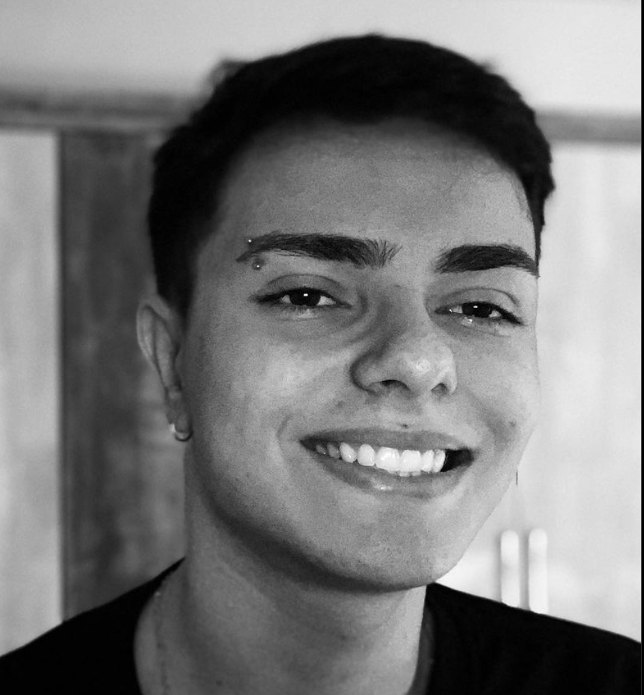

## Apresentação

  

<h2 align="left">Olá 👋! Meu nome é Felipe Donatto e sou um desenvolvedor fullstack.</h2>
<h4 align="left">Tenho 20 anos, trabalhei por quase 1 ano como desenvolvedor fullstack junior, sou programador a 3 anos, gosto muito de café e música. Apaixonado por jogos competitivos e tatuagens, tenho mais de 30 espalhadas pelo corpo. </h4>

    
<strong>👨🏻‍💻 Sprints</strong>

1. [Sprint 1](Sprint%201/README.md)
2. [Sprint 2](Sprint%202/README.md)
3. [Sprint 3](Sprint%203/README.md)
4. [Sprint 1](Sprint%204/README.md)
5. [Sprint 2](Sprint%205/README.md)
6. [Sprint 3](Sprint%206/README.md)
7. [Sprint 1](Sprint%207/README.md)
8. [Sprint 2](Sprint%208/README.md)
9. [Sprint 3](Sprint%209/README.md)
10. [Sprint 3](Sprint%2010/README.md)

