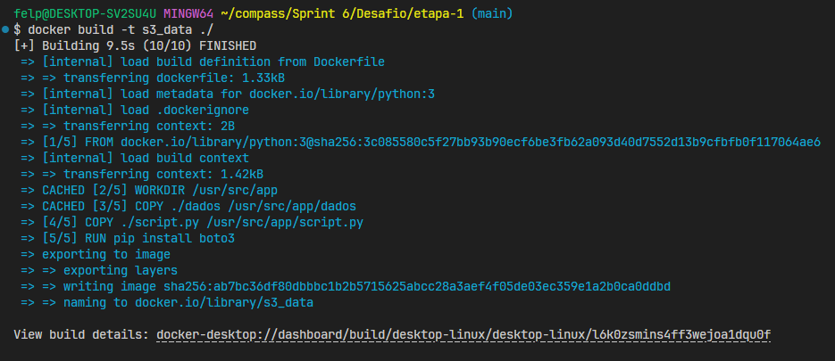
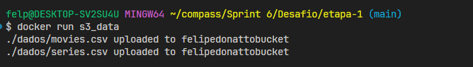
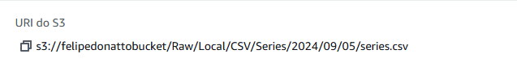

### Perguntas que escolhi com base nas animações com melhores avaliações

1. **Do top 100 animações mais bem avaliadas, quantos são japoneses?**

2. **Entre os melhores avaliados, como os filmes de `Evangelion` se comparam aos demais?**

3. **Quantos filmes do Studio Ghibli estão no top 100? E no top 10?**

4. **Animações japonesas geralmente têm avaliações superiores às de outros países? Qual é a média das avaliações de animações japonesas em comparação com a média mundial?**

### Desafio

O desafio envolvia dois componentes principais:

1. **Script Python com Boto3**

   O script deve interagir com serviços da AWS, mais específicamente o Amazon S3, para realizar o upload de dados.

2. **Dockerfile com Volume**

   O Dockerfile foi utilizado para incluir a configuração de um volume que permita a persistência de dados,
   permitindo que os dois arquivos`.csv` sejam acessados pelo contêiner

O objetivo é garantir que o script Python seja executado de forma eficiente em um ambiente Docker, com um volume que suporte a gestão adequada dos dados.

# Exercícios

1. ...
   [Resposta Ex1.](exercicios/ex1.txt)

2. ...
   [Resposta Ex2.](exercicios/ex2.txt)

# Evidências

Abaixo estão as evidências do contêiner docker sendo utilizado para executar o script.

# Certificados

- Todos os certificados (são muitos).
  
