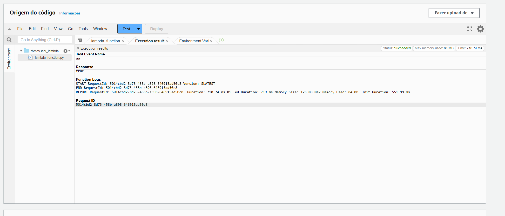

### Perguntas que escolhi com base nas animações com melhores avaliações

1. **Do top 100 animações mais bem avaliadas, quantos são japoneses?**

2. **Entre os melhores avaliados, como os filmes de `Evangelion` se comparam aos demais?**

3. **Quantos filmes do Studio Ghibli estão no top 100? E no top 10?**

4. **Animações japonesas geralmente têm avaliações superiores às de outros países? Qual é a média das avaliações de animações japonesas em comparação com a média mundial?**

### Desafio

O desafio consiste em:

1. **Script Python com request para API**

   O script deve interagir com serviços da AWS, mais específicamente o Amazon S3 e AWS Lambda, para realizar o upload de dados após fazer requisição para API do TMDB.

# Exercícios

1. [Glue Lab](../exercicios/glue_lab/job_aws_glue_lab_4.py)

# Evidências

Após executar o script no Lambda corretamente a seguinte tela foi mostrada, com o retorno true definido na minha função.

