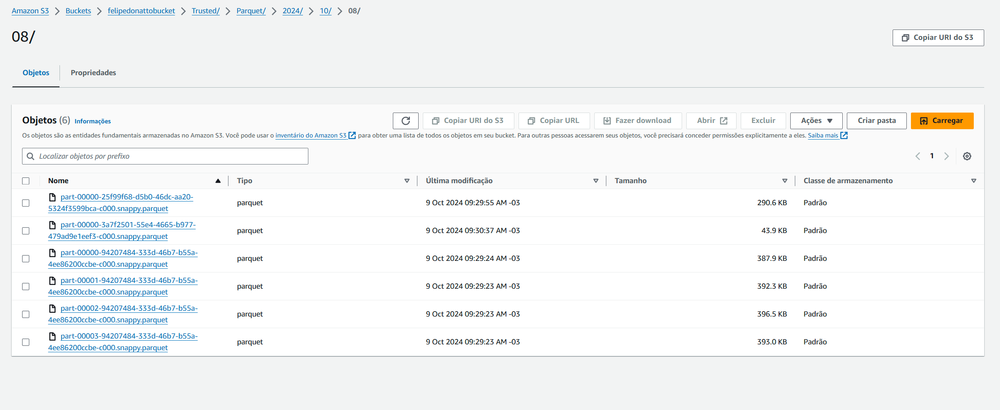
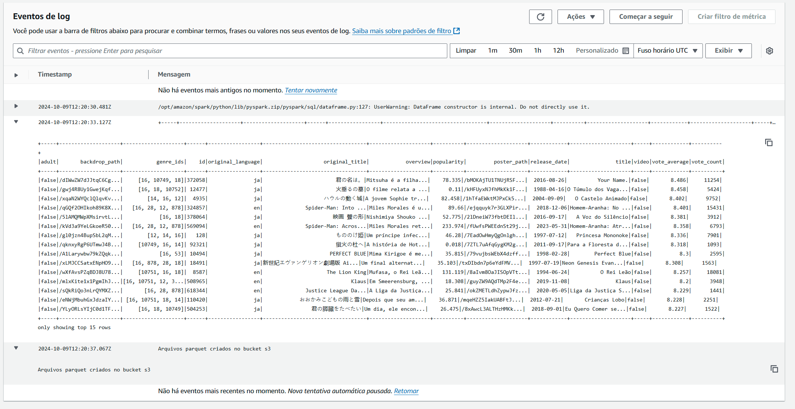
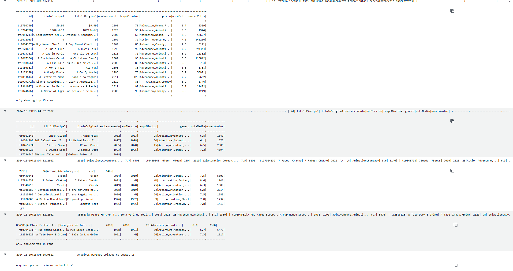

### Perguntas que escolhi com base nas animações com melhores avaliações

1. **Do top 100 animações mais bem avaliadas, quantos são japoneses?**

2. **Entre os melhores avaliados, como os filmes de `Evangelion` se comparam aos demais?**

3. **Quantos filmes do Studio Ghibli estão no top 100? E no top 10?**

4. **Animações japonesas geralmente têm avaliações superiores às de outros países? Qual é a média das avaliações de animações japonesas em comparação com a média mundial?**

# Exercícios

1. EXERCÍCIO DE SPARK BATCH
   [Resposta Ex1.](exercicios/spark_batch_step01-02.py)
   [Resposta Ex1.1](exercicios/spark_batch_step03.py)

2. EXERCÍCIO DE MANIPULAÇÃO DE DADOS COM SPARK
   [Resposta Ex2.](exercicios/apache_spark.py)

# Evidências

#### APÓS CRIAR OS PARQUETS NO BUCKET

#### LOGS DA CRIAÇÂO DOS PARQUETS DO JSON

#### LOGS DA CRIAÇÂO DOS PARQUETS DOS CSVS

